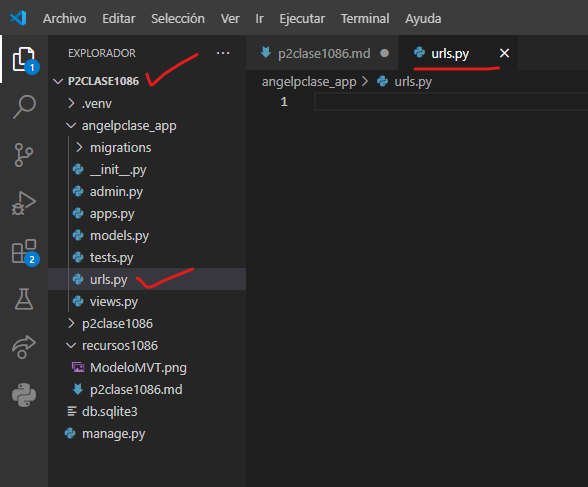
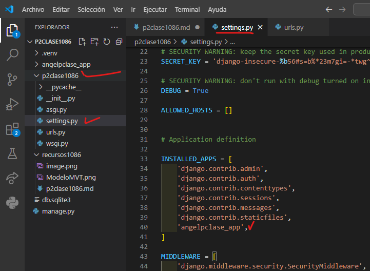
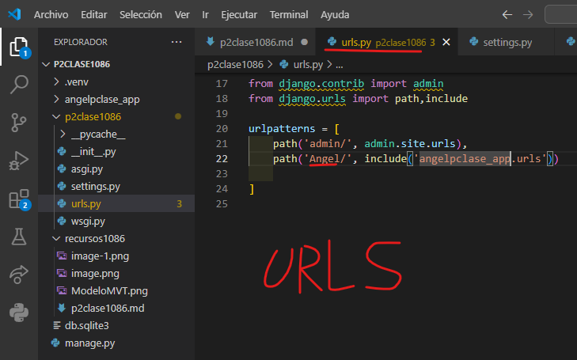
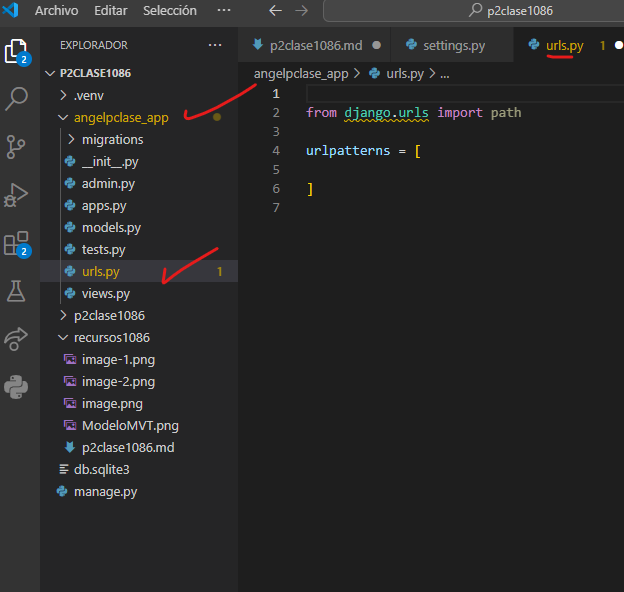
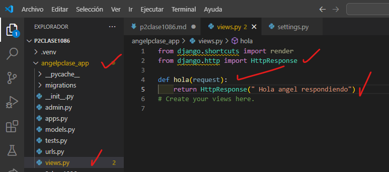
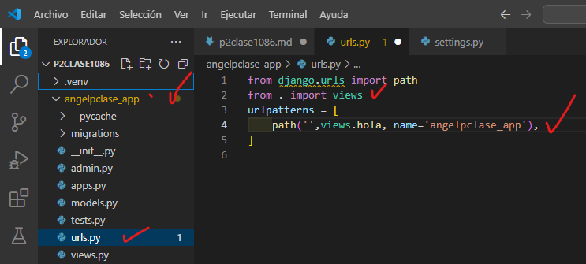

- Crear aplicacion angelpclase_app
- comando  --> python manage.py startapp angelpclase_app

- creamos el archivo urls.py en angelpclase_app
- 
- En setting.py de p2clase1086
- 
- En urls.py de p2clase1086
- 
- En urls.py de amgelpclase_app
- 
- en views.py em angelpclase_app
- 
- en urls.py en angelpclase_app
- 
